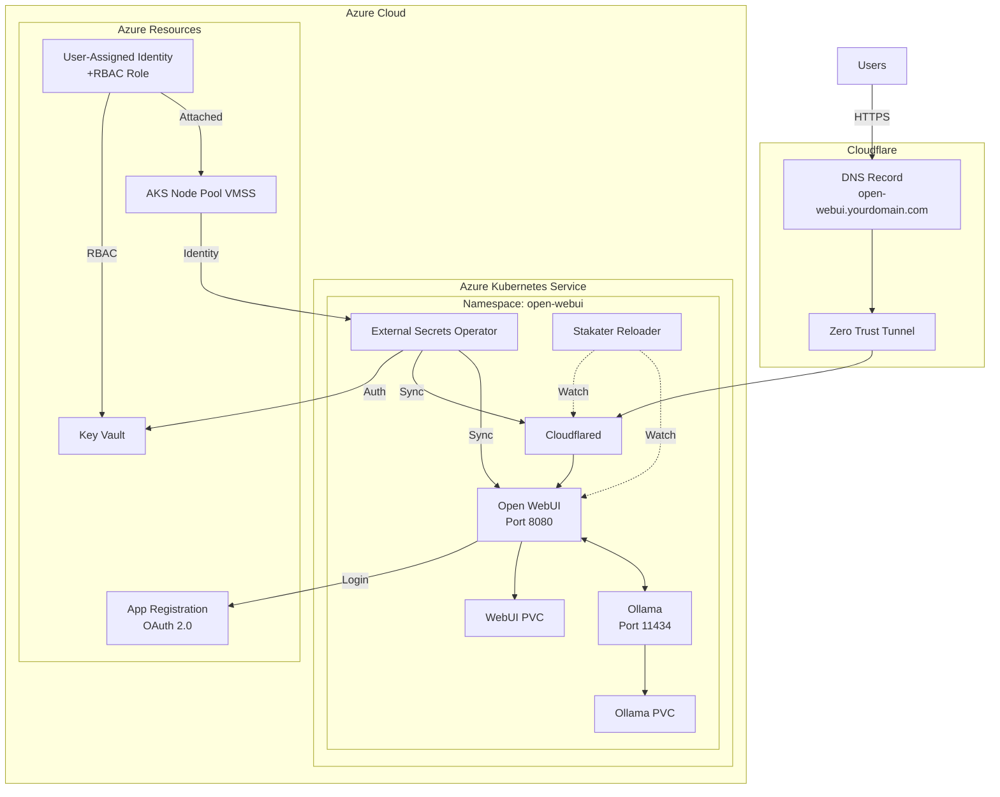

# Open WebUI AKS Deployment

A complete Infrastructure as Code (IaC) solution for deploying [Open WebUI](https://github.com/open-webui/open-webui) and [Ollama](https://ollama.ai/) on Azure Kubernetes Service (AKS) with secure Azure integration, external secret management, and Cloudflare Tunnel for secure external access.

## 📋 Table of Contents

- [Overview](#overview)
- [Architecture](#architecture)
- [Features](#features)
- [Prerequisites](#prerequisites)
- [Project Structure](#project-structure)
- [Quick Start](#quick-start)
- [Configuration](#configuration)
- [Usage Examples](#usage-examples)
- [Customization](#customization)
- [Troubleshooting](#troubleshooting)
- [Security Considerations](#security-considerations)
- [Contributing](#contributing)
- [License](#license)

## 🎯 Overview

This repository provides a production-ready deployment of Open WebUI with Ollama on Azure Kubernetes Service. It automates the complete infrastructure provisioning and application deployment process using Terraform and Kubernetes manifests.

**What is Open WebUI?**
Open WebUI is an extensible, feature-rich, and user-friendly self-hosted WebUI designed to operate entirely offline. It supports various LLM runners, including Ollama and OpenAI-compatible APIs.

**What is Ollama?**
Ollama allows you to run large language models locally, providing privacy and control over your AI workloads.

## 🏗️ Architecture



### Component Flow:

1. **Terraform** provisions Azure resources (AKS, Storage, Key Vault, Managed Identity, App Registration)
2. **User-Assigned Managed Identity (UAI)** is assigned **Key Vault Secrets Officer** role and attached to the AKS node pool
3. **Kubernetes manifests** deploy Open WebUI and Ollama with persistent storage
4. **External Secrets Operator** uses the UAI to sync secrets from Azure Key Vault to Kubernetes
5. **Stakater Reloader** watches for secret/configmap changes and automatically restarts affected pods
6. **Cloudflare Tunnel** provides secure external access without exposing public IPs
7. **Azure AD OAuth** enables secure authentication with Microsoft accounts

## ✨ Features

- **🚀 Automated Infrastructure Provisioning**: Complete Azure resource setup via Terraform
- **🔐 Secure Secret Management**: Azure Key Vault with User-Assigned Managed Identity (no credentials in code)
- **🔑 RBAC-Based Access**: UAI with Key Vault Secrets Officer role assigned to AKS node pool
- **🔄 Automatic Secret Rotation**: Stakater Reloader automatically restarts pods when secrets are updated
- **🌐 Cloudflare Tunnel Integration**: Zero-trust network access without public IP exposure
- **🔑 Azure AD SSO**: Microsoft OAuth 2.0 authentication for secure user access
- **💾 Persistent Storage**: Azure Managed Disks for data durability
- **🎯 Production-Ready**: Includes health checks, resource limits, and high availability configurations
- **🔧 Modular & Extensible**: Easy to customize for different environments and requirements

## 📦 Prerequisites

Before you begin, ensure you have the following:

### Required Tools

- **Terraform** >= 1.14.0 ([Installation Guide](https://developer.hashicorp.com/terraform/downloads))
- **Azure CLI** >= 2.50.0 ([Installation Guide](https://docs.microsoft.com/en-us/cli/azure/install-azure-cli))
- **kubectl** >= 1.28.0 ([Installation Guide](https://kubernetes.io/docs/tasks/tools/))
- **Cloudflare Account** with API token access

### Azure Resources

- Active Azure subscription
- Permissions to create:
  - Resource Groups
  - AKS Clusters
  - Storage Accounts
  - Key Vaults
  - Managed Identities
  - App Registrations (Azure AD)

### Kubernetes Addons

Your AKS cluster should have:
- **External Secrets Operator** installed ([Installation Guide](https://external-secrets.io/latest/introduction/getting-started/))
- **Stakater Reloader** installed ([Installation Guide](https://github.com/stakater/Reloader)) - Automatically restarts pods when secrets/configmaps change

### Azure Identity Setup

This deployment uses **User-Assigned Managed Identity (UAI)** for secure Key Vault access:
- **UAI** is created and assigned the **Key Vault Secrets Officer** role on the Key Vault
- **UAI is attached to the AKS node pool (VMSS)** so pods can use it
- **External Secrets Operator** uses this identity to sync secrets from Azure Key Vault
- No credentials or secrets needed in configuration files

**Why this approach?**
- ✅ No service principal credentials to manage
- ✅ No passwords or keys stored in Kubernetes
- ✅ Azure RBAC for fine-grained access control
- ✅ Identity lifecycle managed by Azure
- ✅ Follows Azure security best practices

## 📁 Project Structure

```
open-webui-aks-deployment/
├── README.md
├── tf_files/                          # Terraform configurations
│   ├── 0-provider.tf                  # Provider configurations (Azure, Cloudflare, Kubernetes)
│   ├── 1-state.tf                     # Remote state backend configuration
│   ├── 2-locals.tf                    # Local variables and configuration
│   ├── 3-rg.tf                        # Resource group definitions
│   ├── 4-storage.tf                   # Azure Storage account for state/data
│   ├── 5-uai.tf                       # User-assigned managed identity
│   ├── 6-kv.tf                        # Azure Key Vault setup with RBAC roles
│   ├── 7-cf_tunnel.tf                 # Cloudflare tunnel configuration
│   ├── 8-app-reg.tf                   # Azure AD app registration for SSO
│   ├── 9-webui-secret.tf              # WebUI secret key generation
│   ├── 10-uai-nodepool-assignment.tf  # Assign identity to AKS nodes (VMSS)
│   └── 12-k8s-deployment.tf           # Kubernetes resource deployment
│
└── yaml_files/                        # Kubernetes manifests
    ├── 0-namespace.yaml               # Namespace definition
    ├── 1-ollama-pvc.yaml              # Ollama persistent volume claim
    ├── 2-open-webui-pvc.yaml          # Open WebUI persistent volume claim
    ├── 3-secret-store.yaml            # External Secrets store configuration
    ├── 4-external-secret.yaml         # Secret mappings from Key Vault
    ├── 5-config-map.yaml              # Application configuration
    ├── 6-ollama-deployment.yaml       # Ollama deployment
    ├── 7-open-webui-deployment.yaml   # Open WebUI deployment
    ├── 8-ollama-svc.yaml              # Ollama internal service
    ├── 9-open-webui-svc.yaml          # Open WebUI internal service
    └── 10-cf-tunnel.yaml              # Cloudflare tunnel deployment
```

## 🚀 Quick Start

### Step 1: Clone the Repository

```bash
git clone https://github.com/yourusername/open-webui-aks-deployment.git
cd open-webui-aks-deployment
```

### Step 2: Configure Azure Authentication

```bash
# Login to Azure
az login

# Set your subscription
az account set --subscription "YOUR_SUBSCRIPTION_ID"

# Get your AKS credentials
az aks get-credentials --resource-group YOUR_RG --name YOUR_AKS_CLUSTER
```

### Step 3: Update Terraform Variables

Edit `tf_files/2-locals.tf` with your values:

```terraform
locals {
  subscription_id           = "YOUR_AZURE_SUBSCRIPTION_ID"
  location                  = "eastasia"
  
  # Cloudflare
  cf_account_id            = "YOUR_CLOUDFLARE_ACCOUNT_ID"
  cf_zone_id               = "YOUR_CLOUDFLARE_ZONE_ID"
  cf_zone_name             = "yourdomain.com"
  dns_record_name          = "open-webui"
  
  # Tags
  TAG_OWNER                = "your-team@example.com"
  TAG_CREATED_BY           = "your-email@example.com"
}
```

### Step 4: Update Provider Configuration

Edit `tf_files/0-provider.tf`:

```terraform
provider "kubernetes" {
  config_path    = "~/.kube/config"
  config_context = "your-aks-context"
}

provider "azuread" {
  tenant_id = "YOUR_AZURE_TENANT_ID"
}
```

### Step 5: Deploy Infrastructure with Terraform

```bash
cd tf_files

# Initialize Terraform
terraform init

# Review the execution plan
terraform plan

# Apply the configuration
terraform apply
```

### Step 6: Update Kubernetes Manifests

Edit `yaml_files/3-secret-store.yaml` with your **User-Assigned Managed Identity Client ID**:

```yaml
spec:
  provider:
    azurekv:
      authType: ManagedIdentity
      identityId: "YOUR_MANAGED_IDENTITY_CLIENT_ID"  # Get from Terraform output or Azure Portal
      vaultUrl: "https://your-keyvault-name.vault.azure.net/"
```

**Important**: The `identityId` is the **Client ID** (not Object ID) of your User-Assigned Managed Identity. You can find it:
```bash
# From Terraform output
terraform output

# Or from Azure CLI
az identity show --name YOUR_UAI_NAME --resource-group YOUR_RG --query clientId -o tsv
```

Edit `yaml_files/5-config-map.yaml`:

```yaml
data:
  WEBUI_URL: "https://open-webui.yourdomain.com"
  MICROSOFT_CLIENT_ID: "YOUR_MICROSOFT_CLIENT_ID"
  MICROSOFT_CLIENT_TENANT_ID: "YOUR_MICROSOFT_TENANT_ID"
  MICROSOFT_REDIRECT_URI: "https://open-webui.yourdomain.com/oauth/microsoft/callback"
```

### Step 6a: Install Stakater Reloader (Optional but Recommended)

Stakater Reloader automatically restarts pods when their secrets or configmaps are updated:

```bash
# Install using Helm
helm repo add stakater https://stakater.github.io/stakater-charts
helm repo update
helm install reloader stakater/reloader --namespace kube-system

# Or using kubectl
kubectl apply -f https://raw.githubusercontent.com/stakater/Reloader/master/deployments/kubernetes/reloader.yaml
```

The deployments already have the required annotations:
```yaml
annotations:
  secret.reloader.stakater.com/auto: "true"
  configmap.reloader.stakater.com/auto: "true"
```

### Step 7: Deploy Kubernetes Resources

```bash
cd ../yaml_files

# Apply all manifests in order
kubectl apply -f 0-namespace.yaml
kubectl apply -f 1-ollama-pvc.yaml
kubectl apply -f 2-open-webui-pvc.yaml
kubectl apply -f 3-secret-store.yaml
kubectl apply -f 4-external-secret.yaml
kubectl apply -f 5-config-map.yaml
kubectl apply -f 6-ollama-deployment.yaml
kubectl apply -f 7-open-webui-deployment.yaml
kubectl apply -f 8-ollama-svc.yaml
kubectl apply -f 9-open-webui-svc.yaml
kubectl apply -f 10-cf-tunnel.yaml
```

### Step 8: Verify Deployment

```bash
# Check pod status
kubectl get pods -n open-webui

# Check services
kubectl get svc -n open-webui

# View logs
kubectl logs -n open-webui deployment/open-webui
kubectl logs -n open-webui deployment/ollama
```

## ⚙️ Configuration

### Azure AD App Registration

1. **Create App Registration** in Azure Portal:
   - Navigate to Azure Active Directory → App registrations → New registration
   - Name: `open-webui-app`
   - Redirect URI: `https://open-webui.yourdomain.com/oauth/microsoft/callback`

2. **Configure API Permissions**:
   - Add Microsoft Graph permissions: `User.Read`, `openid`, `email`, `profile`, `offline_access`

3. **Create Client Secret**:
   - Go to Certificates & secrets → New client secret
   - Store the secret in Azure Key Vault

### User-Assigned Managed Identity for Key Vault Access

The Terraform configuration automatically:
1. **Creates a User-Assigned Managed Identity (UAI)**
2. **Assigns the "Key Vault Secrets Officer" role** to the UAI on the Key Vault
3. **Attaches the UAI to the AKS node pool (VMSS)** using Azure CLI

This allows pods running on the AKS cluster to:
- Access secrets from Azure Key Vault without credentials
- Use External Secrets Operator with Managed Identity authentication
- Follow Azure security best practices (no passwords/keys in code)

**Terraform files involved:**
- `5-uai.tf` - Creates the User-Assigned Managed Identity
- `6-kv.tf` - Creates Key Vault and assigns RBAC roles
- `10-uai-nodepool-assignment.tf` - Attaches UAI to AKS VMSS

### Cloudflare Tunnel Setup

The Terraform configuration automatically creates:
- Cloudflare Zero Trust Tunnel
- DNS CNAME record pointing to the tunnel
- Tunnel token stored in Azure Key Vault

### Storage Configuration

By default, the deployment uses:
- **Ollama PVC**: 50GB Azure Managed Disk (SSD)
- **Open WebUI PVC**: Azure Managed Disk (configurable size)

To modify storage sizes, edit the PVC manifests:

```yaml
# yaml_files/1-ollama-pvc.yaml
spec:
  resources:
    requests:
      storage: 100Gi  # Change size here
```

## 📚 Usage Examples

### Example 1: Accessing Open WebUI

Once deployed, access Open WebUI at:
```
https://open-webui.yourdomain.com
```

Log in using your Microsoft account (Azure AD).

### Example 2: Loading Ollama Models

```bash
# Connect to the Ollama pod
kubectl exec -it -n open-webui deployment/ollama -- bash

# Pull a model (e.g., llama2)
ollama pull llama2

# List available models
ollama list
```

### Example 3: Checking External Secrets Sync

```bash
# Verify External Secret status
kubectl get externalsecrets -n open-webui

# Check synced Kubernetes secret
kubectl get secret open-webui-secrets -n open-webui -o yaml
```

### Example 4: Scaling Deployments

```bash
# Scale Open WebUI (not recommended with PVC in RWO mode)
kubectl scale deployment open-webui -n open-webui --replicas=2

# Scale Ollama
kubectl scale deployment ollama -n open-webui --replicas=1
```

### Example 5: Viewing Application Logs

```bash
# Stream Open WebUI logs
kubectl logs -f -n open-webui deployment/open-webui

# Stream Ollama logs
kubectl logs -f -n open-webui deployment/ollama

# Stream Cloudflare tunnel logs
kubectl logs -f -n open-webui deployment/cloudflared
```

### Example 6: Updating Configuration

```bash
# Edit ConfigMap
kubectl edit configmap open-webui-config -n open-webui

# Restart deployment to apply changes
kubectl rollout restart deployment open-webui -n open-webui
```

## 🔧 Customization

### Change Resource Limits

Edit the deployment files to adjust CPU and memory:

```yaml
# yaml_files/7-open-webui-deployment.yaml
resources:
  requests:
    memory: "2Gi"
    cpu: "200m"
  limits:
    memory: "4Gi"
    cpu: "1000m"
```

### Add Custom Environment Variables

Add to `yaml_files/5-config-map.yaml`:

```yaml
data:
  # Your custom variables
  CUSTOM_VAR: "value"
  ANOTHER_VAR: "another-value"
```

### Enable Image Generation

Update ConfigMap:

```yaml
data:
  ENABLE_IMAGE_GENERATION: "true"
```

### Change Ollama Base URL

If using external Ollama:

```yaml
data:
  OLLAMA_BASE_URL: "https://external-ollama.example.com"
```

### Add Node Selectors or Tolerations

Edit deployment files to schedule pods on specific nodes:

```yaml
spec:
  template:
    spec:
      nodeSelector:
        workload: ai
      tolerations:
      - key: "dedicated"
        operator: "Equal"
        value: "ai-workload"
        effect: "NoSchedule"
```

### Use Different Storage Class

Modify PVC to use different storage:

```yaml
spec:
  storageClassName: managed-premium  # Or your custom storage class
```

### Enable/Disable Automatic Reloading

The deployments use Stakater Reloader annotations to automatically restart when secrets/configmaps change:

```yaml
# Enable auto-reload for both secrets and configmaps (default)
metadata:
  annotations:
    secret.reloader.stakater.com/auto: "true"
    configmap.reloader.stakater.com/auto: "true"

# Or watch specific secrets/configmaps
metadata:
  annotations:
    secret.reloader.stakater.com/reload: "open-webui-secrets"
    configmap.reloader.stakater.com/reload: "open-webui-config"

# Disable auto-reload
# Simply remove the annotations or set to "false"
```

### Multi-Region Deployment

To deploy in multiple regions:

1. Create separate `locals-{region}.tf` files
2. Use Terraform workspaces:
   ```bash
   terraform workspace new eastasia
   terraform workspace new westeurope
   ```

## 🐛 Troubleshooting

### Pods Not Starting

```bash
# Check pod events
kubectl describe pod -n open-webui POD_NAME

# Common issues:
# - PVC not bound: Check storage class and availability
# - Image pull errors: Verify image name and registry access
# - Resource limits: Check node capacity
```

### Secret Sync Issues

```bash
# Verify External Secrets Operator is running
kubectl get pods -n external-secrets

# Check SecretStore configuration
kubectl get secretstore -n open-webui

# Check ExternalSecret status
kubectl get externalsecret -n open-webui
kubectl describe externalsecret open-webui-secrets -n open-webui

# Verify UAI is attached to VMSS
az vmss identity show --resource-group YOUR_NODE_RG --name YOUR_VMSS_NAME

# Verify UAI has Key Vault access
az role assignment list --assignee YOUR_UAI_CLIENT_ID --scope /subscriptions/YOUR_SUB_ID/resourceGroups/YOUR_RG/providers/Microsoft.KeyVault/vaults/YOUR_KV_NAME

# Check if Reloader is installed and running
kubectl get pods -n kube-system -l app=reloader

# Test Key Vault access from a pod
kubectl run -it --rm debug --image=mcr.microsoft.com/azure-cli --restart=Never -n open-webui -- bash
# Inside the pod:
az login --identity
az keyvault secret list --vault-name YOUR_KV_NAME
```

### Pods Not Restarting After Secret Update

```bash
# Verify Stakater Reloader is installed
kubectl get deployment -n kube-system reloader

# Check Reloader logs
kubectl logs -n kube-system deployment/reloader

# Verify deployment has correct annotations
kubectl get deployment open-webui -n open-webui -o yaml | grep reloader

# Manually trigger reload by updating annotation
kubectl patch deployment open-webui -n open-webui \
  -p "{\"spec\":{\"template\":{\"metadata\":{\"annotations\":{\"reloader.stakater.com/reload\":\"$(date +%s)\"}}}}}"
```

### Cloudflare Tunnel Not Working

```bash
# Check tunnel pod logs
kubectl logs -n open-webui deployment/cloudflared

# Verify tunnel token in Key Vault
az keyvault secret show --vault-name YOUR_KV --name cf-tunnel-token

# Check DNS propagation
nslookup open-webui.yourdomain.com
```

### Authentication Issues

```bash
# Verify App Registration redirect URI matches
# Check client ID and tenant ID in ConfigMap
kubectl get configmap open-webui-config -n open-webui -o yaml

# Verify client secret is synced
kubectl get secret open-webui-secrets -n open-webui
```

## 🔒 Security Considerations

### ✅ Best Practices Implemented

- **Secrets Management**: All secrets stored in Azure Key Vault, not in code
- **Managed Identities**: User-Assigned Managed Identity with Key Vault Secrets Officer role (no credentials in files)
- **RBAC Authorization**: Azure RBAC for Key Vault access control
- **VMSS Identity Binding**: UAI attached to AKS node pool for pod-level access
- **Network Security**: Cloudflare Tunnel eliminates public IP exposure
- **RBAC**: Kubernetes RBAC controls access to resources
- **OAuth 2.0**: Secure authentication via Azure AD

### ⚠️ Additional Security Measures

1. **Enable RBAC** on your AKS cluster
2. **Use Network Policies** to restrict pod-to-pod communication
3. **Enable Pod Security Standards**
4. **Rotate secrets regularly** in Azure Key Vault
5. **Monitor access logs** via Azure Monitor
6. **Use Azure Policy** for compliance enforcement

### 🔐 Secrets to Store in Key Vault

Required secrets:
- `WEBUI_SECRET_KEY`: Django secret key for Open WebUI
- `MICROSOFT_CLIENT_SECRET`: Azure AD app client secret
- `TUNNEL_TOKEN`: Cloudflare tunnel token

## 🤝 Contributing

Contributions are welcome! Please feel free to submit a Pull Request.

1. Fork the repository
2. Create your feature branch (`git checkout -b feature/AmazingFeature`)
3. Commit your changes (`git commit -m 'Add some AmazingFeature'`)
4. Push to the branch (`git push origin feature/AmazingFeature`)
5. Open a Pull Request

## 📄 License

This project is licensed under the MIT License - see the LICENSE file for details.

## 🙏 Acknowledgments

- [Open WebUI](https://github.com/open-webui/open-webui) - The amazing WebUI for LLMs
- [Ollama](https://ollama.ai/) - Run large language models locally
- [External Secrets Operator](https://external-secrets.io/) - Kubernetes secret management
- [Stakater Reloader](https://github.com/stakater/Reloader) - Automatic pod reloading on config changes
- [Cloudflare Zero Trust](https://www.cloudflare.com/zero-trust/) - Secure network access

## 📞 Support

For issues and questions:
- Open an [Issue](https://github.com/yourusername/open-webui-aks-deployment/issues)
- Check existing [Discussions](https://github.com/yourusername/open-webui-aks-deployment/discussions)

---

**⭐ If you find this project helpful, please consider giving it a star!**
